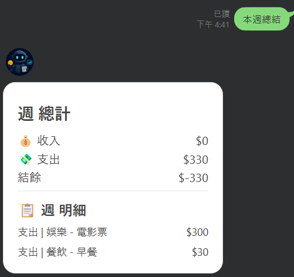
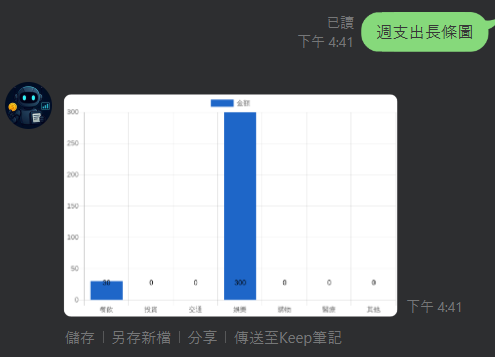

# 🤖 AI 智慧記帳機器人：AI-Line-Bot

AI-Line-Bot 是一個結合 **LINE Messaging API** 與 **PostgreSQL** 的智慧型記帳機器人。使用者只需在 LINE 對話中輸入簡單的訊息（例如：「早餐 60」），系統就會自動解析、儲存，並為您建立個人化的記帳紀錄。

-----

## ✨ 核心功能特色

  * **自動分類與自訂分類**：通過關鍵字 nlp，系統能自動將您的支出歸類
  * **多語言支援**：支援中、英文，能切換語言回覆對應的訊息與選單。
  * **AI 問答**：整合了 ChatGPT，讓您能直接在聊天中進行 AI 互動，詢問理財相關建議。AI 會自動分析您的消費習慣）
  * **記帳管理**：提供查詢、刪除以及本週總結以及統計長條圖等功能。
  * **雲端部署**：專案部署在 Vercel，資料則儲存於 PostgreSQL 資料庫。

-----

## 🛠️ 專案結構

```
AI-LineBot/
├── app.py                        # 應用程式入口
├── .env                          # 環境變數設定
├── .gitignore                    # Git 忽略設定
├── requirements.txt              # Python 套件列表
├── README.md                     # 專案說明文件
├── vercel.json                   # Vercel 部署設定
│
├── database/
│   └── init_schema.sql   # 初始化 schema
│
├── apps/                         # 核心模組
│   ├── common/                   # 共用工具與資料庫操作
│   │   ├── database.py           # 資料庫 CRUD
│   │   └── i18n.py               # 多國語系字典
│   │
│   ├── handlers/                 # LINE Webhook 事件處理
│   │   ├── chart_handler.py      # 圖表產生
│   │   ├── follow_handler.py     # 新增好友事件
│   │   ├── message_handler.py    # 訊息處理
│   │   ├── postback_handler.py   # 按鈕點擊事件
│   │   └── reply_service.py      # FlexMessage 封裝
│   │
│   └── services/                 # 核心商業邏輯與 AI 服務
│       ├── ai_financial_advisor.py   # AI 財務建議
│       ├── call_openai_chatgpt.py    # ChatGPT 整合
│       ├── category_classifier.py    # 分類器
│       ├── reply_service.py          # QuickReply 封裝
│       ├── nlp_router.py             # NLP 意圖判斷與指令路由
│       └── reply_service.py          # QuickReply 封裝

```

-----

## 💡 功能說明

### 📝 自動分類與自訂分類

系統會根據您的輸入，自動將項目分類為以下幾種：

  * **餐飲 (food)**
  * **投資 (investment)**
  * **交通 (transport)**
  * **娛樂 (entertainment)**
  * **購物 (shopping)**
  * **醫療 (medical)**
  * **其他 (others)**

**範例輸入與結果：**

| 使用者輸入 | 自動分類結果 |
| :--- | :--- |
| `午餐 100` | `food` |
| `投資 5000` | `investment` |
| `油錢 500` | `transport` |
| `電影票 300` | `entertainment` |
| `買衣服 800` | `shopping` |
| `看醫生 250` | `medical` |
| `捐款 100` | `others` |

-----

### 🔎 記帳查詢與管理

除了自動記帳，您還可以透過簡單指令來管理您的記帳紀錄，所有回覆以 Flex Message 與圖表呈現。
查帳記錄點垃圾桶即可刪除該筆資料

| 功能 | 指令範例 | 畫面示意 |
| :--- | :--- | :--- |
| **查詢** | `查帳` |  |
| **總結** | `本週總結` |  |
| **圖表** | `週支出長條圖` |  |


### 🌍 語言自動切換

系統會自動偵測您輸入的語言，並以對應的語系回覆，所有文字內容都支援 i18n 設計，便於未來擴充。

-----

## 💡 使用方法與測試範例

此專案設計讓使用者能透過簡單的自然語言進行互動。以下是您可以嘗試的指令與預期結果：

  * **記帳**：輸入 `早餐 60`、`公車 30`、`電影票 300`，系統會自動記錄並分類。
  * **查詢**：輸入 `查帳`，系統會列出最近的記帳紀錄。
  * **刪除**：輸入 `刪除第 1 筆`，可刪除指定的記帳紀錄。
  * **總結**：輸入 `本週總結`，系統會回傳本週的總花費金額。
  * **圖表**：輸入 `週支出長條圖`，可獲得視覺化的支出報表。
  * **AI 諮詢**：
      * `我這週花最多錢的是什麼？`
      * `幫我看看早餐平均花多少？`
      * `給我一個省錢建議`
      * 系統會根據您的問題，利用 AI 進行分析並提供回覆。

-----

## 🚀 快速開始

### 資料庫設計

本專案使用 PostgreSQL，資料庫架構已定義在 database/init_schema.sql 檔案中，包含三個核心資料表：users、transactions 和 categories。

#### 🧑‍💼 `users` (使用者資料)

儲存 LINE 使用者的基本資訊。

  * **id**: 主鍵 ID
  * **line\_user\_id**: LINE 上的唯一 ID
  * **display\_name**: 使用者暱稱
  * **preferred_lang**: 使用者偏好的語言（例如 `zh-TW` 或 `en`）
  * **created\_at**: 帳號建立時間

#### 💰 `transactions` (記帳紀錄)

記錄每一筆支出或收入。

  * **id**: 交易主鍵 ID
  * **user\_id**: 對應 `users` 表
  * **item**: 購買項目
  * **amount**: 金額
  * **category_id**: 對應 `categories` 表
  * **message**: 原始輸入訊息
  * **created\_at**: 記帳時間
  * **type**: 交易類型（`expense` 或 `income`）

#### 🏷️ `categories` (自訂分類)

每位使用者可定義專屬的分類與關鍵字。採用父子階層設計，未來可新增類別。

  * **id**: 分類主鍵 ID
  * **user\_id**: 對應 `users` 表
  * **name**: 分類名稱
  * **parent_id**: 父分類 ID（若為主分類則為自身或 `NULL`）
  * **created\_at**: 建立時間
  * **is\_system\_default**: 是否為系統預設分類（`true` 表示預設分類，`false` 表示使用者自訂）

-----

## 🛠️ LINE Bot 設定與金鑰取得

要讓程式能與 LINE 平台連線，需要先在 LINE Developers 平台完成以下設定：

1.  **建立 Provider 與 Channel**：

      * 前往 [LINE Developers](https://developers.line.biz/console/) 網站並登入。
      * 點選「Create a new provider」，輸入一個名稱後點選「Create」。
      * 進入 Provider 後，點選「Create a new channel」，選擇「Messaging API」。
      * 填寫必要的 Channel 資訊（例如：App name、Category 等），並同意條款。

2.  **取得 Channel Access Token 與 Channel Secret**：

      * 進入剛建立的 Channel，點選左側「Messaging API」分頁。
      * 在頁面下方，您會看到 **`Channel access token`** 和 **`Channel secret`**。
      * 點選「issue」或「reissue」來生成 Access Token。請將這兩個金鑰妥善保管，它們是讓程式與 LINE 平台溝通的唯一憑證。

3.  **設定 Webhook URL**：

      * 在「Messaging API」分頁中找到「Webhook settings」，點選「Edit」輸入您的 Webhook URL。
      * 部署到 **Vercel** 後，您的 Webhook URL 格式會是 `https://<YOUR_VERCEL_PROJECT_NAME>.vercel.app/callback`。
      * 記得點選「Verify」來驗證 URL 是否有效，並將「Use webhook」選項開啟。

-----
## 🔗 AI 模型串接與 API 申請方式
本專案使用 OpenAI GPT API（例如 gpt-3.5-turbo）來分析使用者的消費資料並提供理財建議。

申請 OpenAI API Key 步驟
1. 註冊帳號
前往 OpenAI 官方網站 建立帳號。

2. 建立 API 金鑰
登入後，進入 API Keys 頁面，點選 Create new secret key 生成新的金鑰。

⚠️ 請妥善保存金鑰，離開頁面後將無法再次查看完整金鑰。

-----

## 🚀 部署至 Vercel

本專案部署到 Vercel，提供穩定的伺服器環境。

1.  **建立 Vercel 帳號**：

      * 前往 [Vercel](https://vercel.com/) 網站，使用 GitHub 帳號註冊登入。

2.  **串接專案**：

      * 在 Vercel Dashboard 中，點選「Add New...」\>「Project」。
      * 選擇您的 GitHub 帳號，並匯入包含此專案的 Git Repository。

3.  **設定環境變數**：

      * 在專案設定頁面，找到「Environment Variables」區塊。
      * 點選「Add」，新增以下變數：
          * **`LINE_CHANNEL_SECRET`**: 填入您從 LINE Developers 取得的 **Channel secret**。
          * **`LINE_CHANNEL_ACCESS_TOKEN`**: 填入您從 LINE Developers 取得的 **Channel access token**。
          * **`DATABASE_URL`**: 填入您的 PostgreSQL 資料庫連線字串。
          * **`OPENAI_API_KEY`**: 填入您的 OpenAI API 金鑰，用於 AI 相關功能。
          * **`SUPABASE_URL`**: 填入您 Supabase 專案的 API URL，用於圖表上傳與檔案儲存功能。  
          * **`POSTGRES_URL`**: 填入您的 PostgreSQL 資料庫連線字串

4.  **部署**：

      * 完成設定後，點選「Deploy」。Vercel 會自動從您的 Git Repository 取得程式碼，並完成部署。
      * 部署成功後，您會獲得一個專屬的網址，例如 `https://ai-line-bot.vercel.app`。這個網址就是您在 LINE Developers 後台需要設定的 **Webhook URL**。

-----

## 🧑‍💻 作者

佳融 Wu — [GitHub](https://github.com/Amber016020/LineBudgetBotAI)